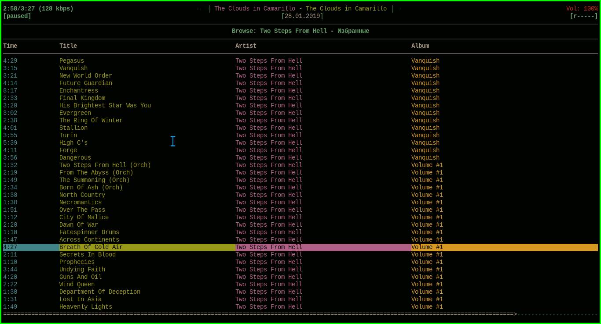

#Arch_dotfiles#

Пользуюсь оконным менеджером DWM

В основном программы, которые я использую написанны на Си++

Основные программы:

| Название программы | Описание                                     |
| --------           | --------                                     |
| sxiv               | image/gif viewer                             |
| mpv                | video player                                 |
| lf                 | file manager                                 |
| mpd/ncmpcpp        | music                                        |
| neovim             | text editor                                  |
| zsh                | shell                                        |
| gimp/inkscape      | editor image                                 |
| bookmenu           | fast acсess to files{config,video,bookmarks} |

## zsh
 

## ncmpcpp
 
